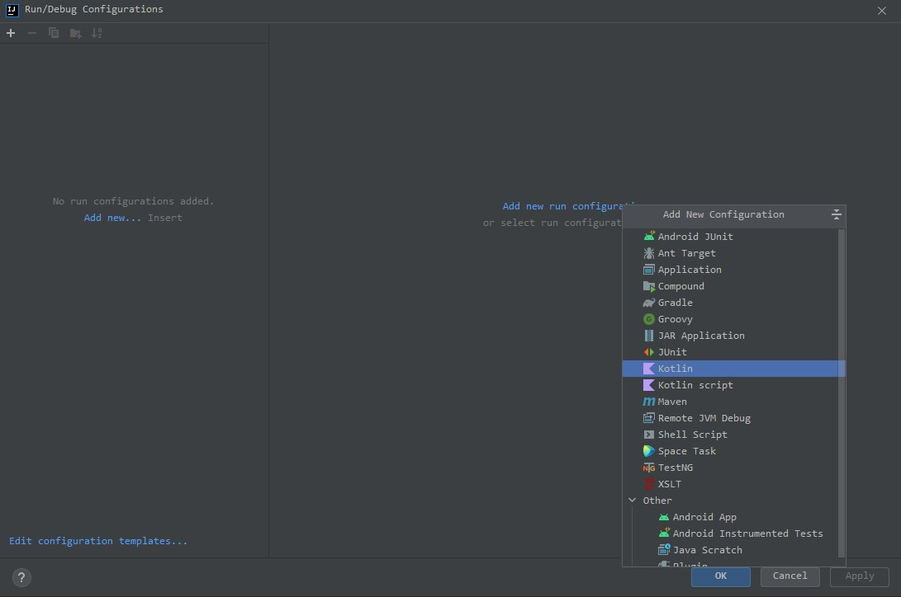
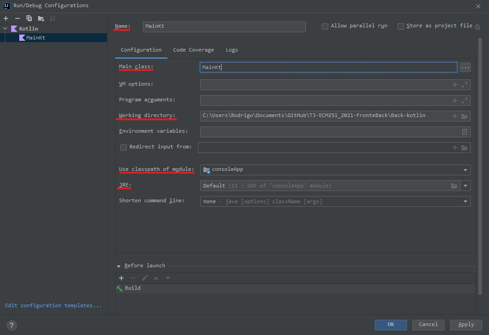

# Back-end
Trabalho de ECM251 - Linguagens de Programação, 2021.

## **Grupo 12**
* Rodrigo Machado Pedreira    &emsp;             18.01569-7  &emsp;  Lab. 2
* Gustavo Lourenço  &emsp; &emsp; &emsp; &emsp;  19.00345-5  &emsp;  Lab. 3
* Conrado Pupo Azzalin     &emsp;&emsp;&emsp;    19.01490-2  &emsp;  Lab. 3

[Repositorio GitHub](https://github.com/Rodrigo-Pedreira/T3-ECM251_2021-FronteBack)
- - -
## Visão geral

Foi projetado na linguagem *Kotlin*.  

Breve lista de componentes:
* Classe que controla o sistema;
* Classes que conectam e manipulam o banco de dados;
* Classes modelo que condizem com as entradas de uma tabela no banco de dados;
* Classes que gerenciam requisições HTTP provindas do website;
* Classe que contem constantes;
* Classes que testam a manipulação do banco de dados.

## Como rodar
### Com *IntellJ*
É necessario criar um perfil de run/debug configurantion.  
\
\
  
Clique em add configuration no canto superior direito, assim como mostra a imagem.
\
\
\
  
Ao clicar uma janela como está deve aparecer. Clique em "Add new configuration" e escolha *Kotlin* no menu que ira aparecer.
\
\
\
  
Agora escolha um nome arbitrario para o perfil \(Name\).  
Digite \"**MainKt**\" \(sem aspas\) no campo \"Main class\", é importante **digitar** manualmente e **não** usar os 3 pontinhos ao lado direito da barra.  
Cheque se seu diretorio de trabalho \(Working directory\), que já estava prenchido, está correto.  
Os outros dois campos destacados também já devem estar prenchidos, confira-os.

Pronto o perfil esta criado, lembre que clicar em **OK** para salvar.