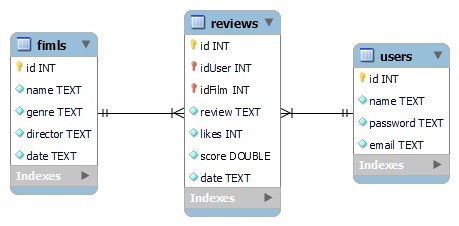

# Trabalho de ECM251 - Linguagens de Programação, 2021.

## **Grupo 12**
* Rodrigo Machado Pedreira    &emsp;             18.01569-7  &emsp;  Lab. 2
* Gustavo Lourenço  &emsp; &emsp; &emsp; &emsp;  19.00345-5  &emsp;  Lab. 3
* Conrado Pupo Azzalin     &emsp;&emsp;&emsp;    19.01490-2  &emsp;  Lab. 3

[Repositorio GitHub](https://github.com/Rodrigo-Pedreira/T3-ECM251_2021-FronteBack)
- - -
## Sobre o projeto

A proposta do trabalho é criar um website de reviews. Pode ser de filmes, livros, animes, ou outros temas. Nosso grupo escolheu avaliar filmes.

São tres os componentes principais do projeto: *back-end*, *front-end* e um *banco de dados*.

#### Back-end
Foi escrito na linguagem *Kotlin*, utiliza o *Mavem* como gerenciador de projeto e *ktor* para criar o servidor web.

#### Front-end
Foi escrito na linguagem *Flutter*, é muito simples com poucas funcionalidades mas desmpenha o papel necessario para o trabalho.

#### Banco de dados
Utilizamos o *MariaDB* como gerenciador do banco. Este roda numa maquina virtual local.  

### Um pouco mais sobre o projeto
Criamos um website em que o usuario pode postar reviews e também visualizar e avaliar reviews feitas por outras pessoas.  

O tanto o site quanto o banco de dados rodam no localhost e no momento não são acessíveis pela internet.  

O banco de dados, gerenciado com *MariaDB* roda numa maquina virtual. Este tem tres tabelas: uma para usuarios, uma para reviews e uma para filmes.

## Diagrama do banco de dados

